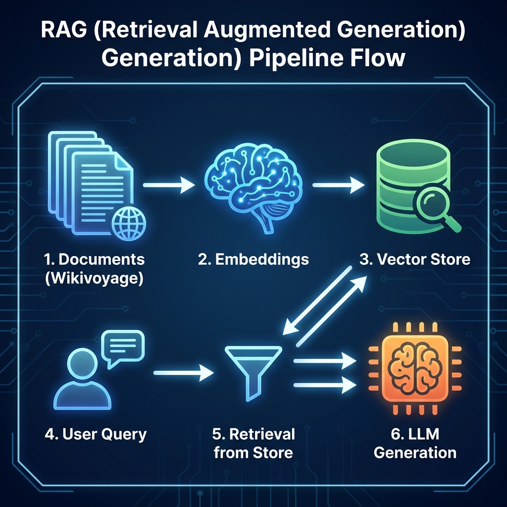
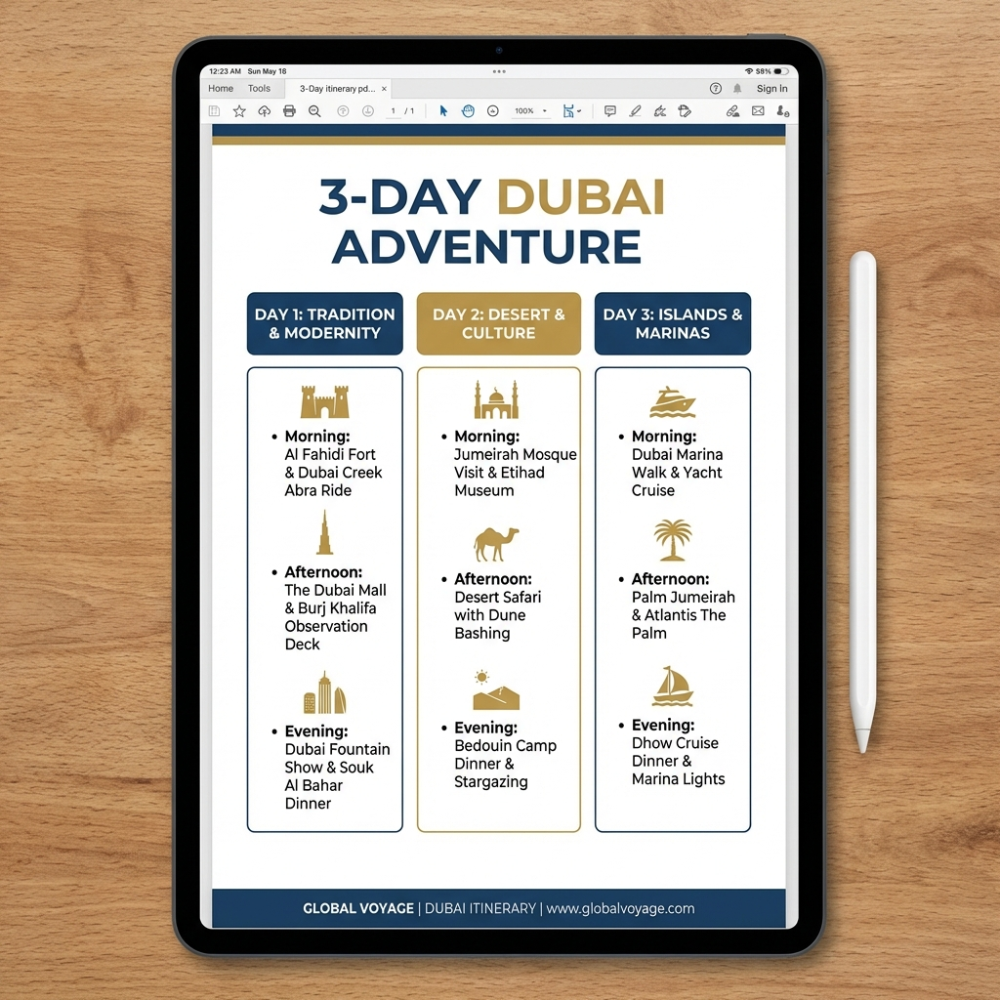

# Voice First AI Travel Assistant for Dubai

> A voice driven, grounded AI system that creates and edits feasible travel itineraries using real data, MCP tools, RAG, and live evaluations.


*(Matches formatting: Place `hero.png` in an `assets` folder)*

## Problem Statement

Planning a trip is often an overwhelming experience. Travelers spend hours sifting through fragmented information across dozens of browser tabs, trying to piece together a coherent schedule. Static itineraries found online rarely match specific personal constraints like time, pace, or interests.

Furthermore, traditional chatbots often "hallucinate" travel advice or suggest geographically impossible sequences (e.g., visiting two distant locations in just one hour). A system was needed that combines the natural ease of voice interaction with the reliability of constraint-aware planning.

## What We Built

We built a **Voice First AI Travel Assistant** specifically optimized for **Dubai**. This system allows users to plan comprehensive travel itineraries simply by speaking. Unlike standard chatbots, this assistant:
- Understands complex constraints (budget, pace, interests).
- **Orchestrates** multiple specialized AI tools (MCPs) to build feasible plans.
- **Edits** itineraries safely using voice (e.g., "Make day 2 more relaxed").
- **Grounds** its knowledge in real tourism data (Wikivoyage, official portals).
- **Exports** professional PDF plans directly to the user's email.

## Core Features

- **Voice based trip planning**: Natural language interaction to define trip parameters.
- **Smart clarifying questions**: The AI asks for missing details (e.g., "How many days?") before planning.
- **Constraint confirmation**: clear validation of user intents before execution.
- **Day wise itinerary generation**: Structured plans broken down by Morning, Afternoon, and Evening.
- **Voice based itinerary editing**: Intelligent modification of specific days without breaking the rest of the plan.
- **Grounded explanations with sources**: Answers about "Why this plan?" are backed by real citations.
- **Feasibility and safety checks**: Automated evaluation of time allocation and geographical logic.
- **PDF export and email delivery**: One-click export of the final plan to a professional PDF.
- **Production ready deployment**: Fully containerized and deployed architecture.

## System Architecture

The system follows a modular Orchestrator-Agent pattern:

- **Frontend**: Built with **Next.js** and **Tailwind CSS**, providing a responsive voice interface using the Web Speech API.
- **Backend**: A **Node.js/TypeScript** server that acts as the central Orchestrator. It manages the conversation state machine (Idle -> Planning -> Editing -> etc.).
- **MCP Layer**: Specialized Model Context Protocol tools handle discrete tasks:
  - `POI Search`: Queries real-world location data.
  - `Itinerary Builder`: Algorithms to slot activities into logical time blocks.
- **RAG Pipeline**: A dedicated service for Retrieval Augmented Generation using local embeddings and a vector store to answer user questions factually.


*(Matches formatting: Place `architecture.png` in an `assets` folder)*

## MCP Tools Used

The system delegates complex logic to specialized tools to ensure reliability:

### POI Search MCP
- **Inputs**: City (Dubai), User Interests (e.g., "History", "Food"), Constraints.
- **Outputs**: Ranked list of Points of Interest with metadata (open hours, type, location).
- **Role**: Finds the "ingredients" for the trip.

### Itinerary Builder MCP
- **Inputs**: List of POIs, Trip Duration (days), Pacing preference.
- **Outputs**: Structured, day-wise JSON itinerary.
- **Role**: Acts as the "chef," assembling the ingredients into a logical schedule.

## Retrieval Augmented Generation

To prevent hallucinations, the assistant uses a RAG pipeline for all explanatory queries.

- **Sources**: Data is ingested from **Wikivoyage**, **Wikipedia**, and the **VisitDubai** portal.
- **Process**:
  1. Text is chunked and embedded using local transformer models.
  2. Embeddings are stored in a **Chroma** vector database.
  3. When a user asks "Why is this a good plan?", the system retrieves relevant context chunks.
  4. The LLM generates an answer based *only* on these retrieved chunks, attaching citations.


*(Matches formatting: Place `rag-flow.png` in an `assets` folder)*

## AI Evaluations

The system implements "Self-Correction" through live evaluations. Every plan is checked before being shown to the user:

1. **Feasibility Evaluation**: Checks if the schedule is physically possible (time vs. distance).
2. **Edit Correctness Evaluation**: When a user asks to "Change Day 2," this check ensures that *only* Day 2 was modified and that Day 1 and Day 3 remain untouched.
3. **Grounding Evaluation**: Verifies that suggested places actually exist in the database.

## Datasets Referenced

### OpenStreetMap via Overpass API
Used for discovering points of interest such as attractions, restaurants, museums, and landmarks in Dubai. All POI recommendations map back to OpenStreetMap records.

### Wikivoyage
Used for practical travel guidance including areas to visit, safety tips, etiquette, and local advice. These documents are indexed in the RAG pipeline and cited in explanations.

### Wikipedia
Used for background context on major attractions and cultural landmarks. Provides historical and descriptive grounding for itinerary explanations.

*Note: If any data is missing or unreliable, the system explicitly communicates uncertainty instead of guessing.*

## Running Evaluations

The system includes three automated evaluation layers that run during normal usage:

### Feasibility Evaluation
Runs after itinerary generation. Checks that daily schedules fit within available time, travel time is reasonable, and pace is consistent with user preference.

### Edit Correctness Evaluation
Runs after every voice based edit. Ensures that only the intended day or time block is modified and no unintended parts of the itinerary change.

### Grounding and Hallucination Evaluation
Runs after explanations and recommendations. Verifies that POIs map to real dataset records and that travel tips are backed by RAG sources. If grounding is not possible, the system explicitly states uncertainty.

### How to verify evaluations

Evaluations run automatically and results are surfaced in the UI under the Planning Checks panel. A developer can verify them during development by:
- Running the app locally.
- Triggering a plan or edit.
- Checking evaluation logs in the backend console.
- Reviewing the evaluation output returned in the API response (`/api/orchestrate`).

## Sample Test Transcripts

### Transcript 1: Voice Based Planning
**User**: Plan a 3 day trip to Dubai next weekend. I like food and culture, relaxed pace.
**Assistant**:
- Confirms constraints.
- Generates a day wise itinerary.
- Runs feasibility evaluation and shows Passed.

### Transcript 2: Voice Based Editing
**User**: Make Day 2 more relaxed.
**Assistant**:
- Identifies edit intent.
- Updates only Day 2 schedule.
- Runs edit correctness evaluation and confirms only Day 2 changed.

### Transcript 3: Grounded Explanation
**User**: Why did you choose Al Fahidi Historical District?
**Assistant**:
- Explains the choice using cultural relevance and proximity to other activities.
- Displays citations from Wikivoyage and Wikipedia in the Sources panel.
- Runs grounding evaluation and confirms that all references map to real data.


## Voice Experience

We prioritized a "Voice First" design. The interface relies on the **Web Speech API** for low-latency speech recognition directly in the browser. Users can speak naturally to:
- Key in their initial request.
- Answer clarifying questions.
- Command edits ("Swap dinner for a sea view restaurant").

## Itinerary Export

Completing the user journey, the application includes a server-side PDF generation engine.
- **Process**: The JSON itinerary is converted into a styled PDF document using `pdfkit`.
- **Delivery**: The file is securely emailed to the user via `nodemailer`.
- **Value**: Users get a tangible, offline takeaway from their session.


*(Matches formatting: Place `pdf-preview.png` in an `assets` folder)*

## Tech Stack

### Frontend
- **Next.js**: React framework for production.
- **Tailwind CSS**: Styling and responsive design.
- **Web Speech API**: Native browser speech recognition.
- **Lucide React**: Iconography.

### Backend
- **Node.js & TypeScript**: Core runtime and language.
- **Express**: API server.
- **LangChain**: AI chain management.
- **Groq SDK**: Fast inference for Llama 3 models.
- **PDFKit & Nodemailer**: Export functionality.

### AI & Data
- **Model Context Protocol (MCP)**: Tool orchestration standard.
- **Chroma**: Vector database for RAG.
- **OpenStreetMap (Overpass API)**: Live POI data.

### Infra
- **Render**: Backend deployment.
- **Vercel**: Frontend deployment.

## How to Run Locally

### Prerequisites
- Node.js 18+
- Groq API Key

### 1. Clone the Repository
```bash
git clone https://github.com/AmaanKamil/AI-Travel-Assistant.git
cd AI-Travel-Assistant
```

### 2. Setup Backend
```bash
cd ai-travel-planner/backend
npm install
# Create .env file with required variables (see below)
npm run dev
```

### 3. Setup Frontend
```bash
cd ai-travel-planner/frontend
npm install
# Create .env.local file if needed
npm run dev
```

Visit `http://localhost:3000` to start the app.

## Environment Variables

The project relies on environment variables for security. Do not commit these to Git.

### Backend (`.env`)
- `PORT`: Server port (default: 3000).
- `GROQ_API_KEY`: API key for the LLM inference.
- `SMTP_HOST`: Email server host (e.g., smtp.gmail.com).
- `SMTP_PORT`: Email server port (587).
- `SMTP_USER`: Email address for sending exports.
- `SMTP_PASS`: Application password for email.
- `FROM_EMAIL`: Sender address.
- `CHROMA_URL`: (Optional) URL for external Chroma instance.

### Frontend (`.env.local`)
- `NEXT_PUBLIC_API_URL`: Backend URL (e.g., http://localhost:3000).

## Deployment

### Backend (Render)
The backend is deployed as a Web Service on **Render**.
- Build Command: `npm install --legacy-peer-deps && npm run build`
- Start Command: `npm run start`

Verify deployment by visiting: `https://<your-app>.onrender.com/health`

### Frontend (Vercel)
The frontend is deployed on **Vercel**.
- Configured to connect to the Render backend via `NEXT_PUBLIC_API_URL`.

## Demo Walkthrough

1. **Start**: Open the app and click the mic button.
2. **Plan**: Say "Plan a 3-day trip to Dubai focusing on food and culture."
3. **Clarify**: If you omit the days, the AI will ask "How many days?"
4. **View**: Watch the system generate a structured itinerary.
5. **Explain**: Ask "Why did you pick these places?" to see grounded RAG answers with sources.
6. **Edit**: Say "Make Day 2 more relaxed" and observe the targeted update.
7. **Export**: Enter your email to receive the PDF plan.

## Repository Structure

```
ai-travel-planner/
├── backend/                # Node.js/Express Server
│   ├── src/
│   │   ├── orchestrator/   # State machine & logic
│   │   ├── services/       # MCPs, RAG, PDF services
│   │   ├── rag/            # Embedding & Ingestion
│   │   └── utils/
├── frontend/               # Next.js Application
│   ├── components/         # React UI Components
│   └── lib/                # API Client
└── assets/                 # Documentation images
```
